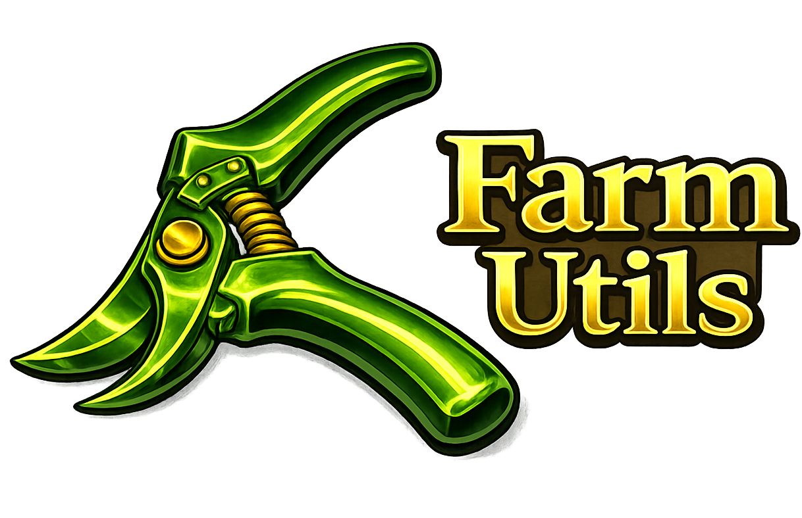
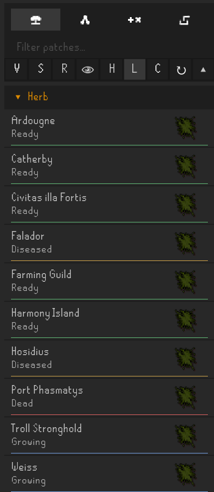
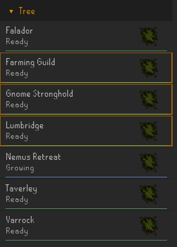
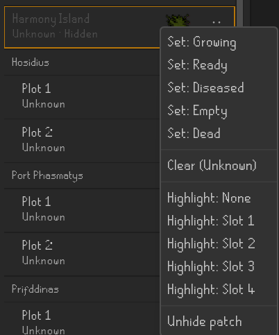
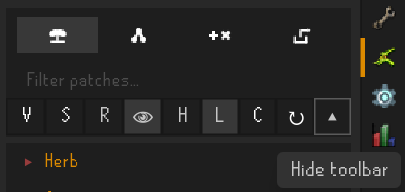
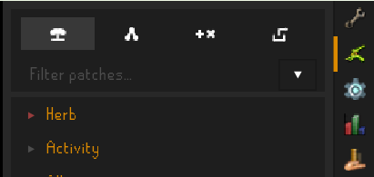

# Farm Utils

Farm Utils is a restrained RuneLite plugin for observing and organizing farming patch state in Old School RuneScape.

It focuses on visibility and interaction surface rather than optimization. It does not prescribe routes, enforce workflows, or claim authority over game mechanics. It provides structure and leaves decisions to the player.

---

## Patches Panel

The Patches panel presents farming patches as a manipulable surface. Layout, grouping, ordering, and visibility are user-controlled. State is shown clearly without interpretation beyond what is locally available.

---

## Selection & Reordering

The panel supports runtime-only multi-selection with standard semantics:

- Click for single select  
- Ctrl to toggle  
- Shift for range  
- Ctrl+Shift for additive range  

Right-click actions respect the current selection set.

Drag handles allow reordering of groups and patches where structurally valid.

---

## Context Menu

State changes, highlights, and visibility controls are accessed through contextual menus. Disabled patches are hidden by default and can be revealed through the toolbar toggle.

---

## Toolbar States

### Visible

### Hidden

The toolbar can be hidden to reduce visual density and restored through the inline toggle.

---

## Core Features

- Multiple view modes (grouped / flat)
- Collapse / expand all groups (where applicable)
- Drag reordering (groups and individual patches)
- Patch enable / disable per row
- Toolbar toggle to show / hide disabled patches
- Runtime-only multi-selection system
- Configurable visual selection outline
- State indicators (text and icon modes)
- Toolbar hide / show toggle

---

## Current Scope

Implemented:

- Patches panel surface
- View modes (grouped / flat)
- Collapse / expand all
- Drag reordering
- Patch enable / disable
- Runtime multi-selection
- Visual state indicators
- Toolbar visibility controls

Not implemented:

- Persistent selection
- Route creation or route planning UI
- Cloud synchronization
- Social systems, reputation, or identity layers
- External data authority beyond local client observation

Farm Utils is a local tool. Client-side state remains the source of truth.