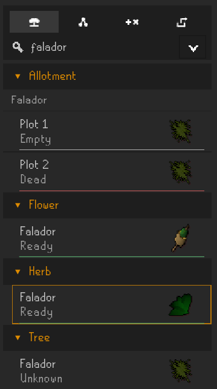
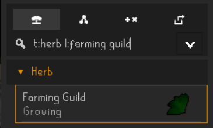
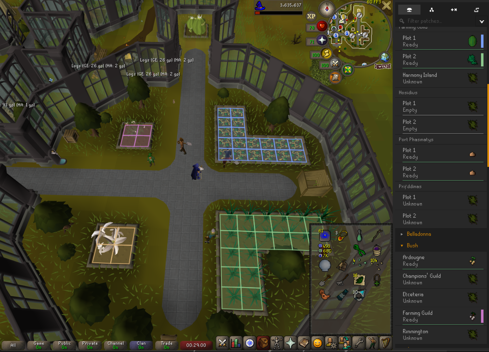
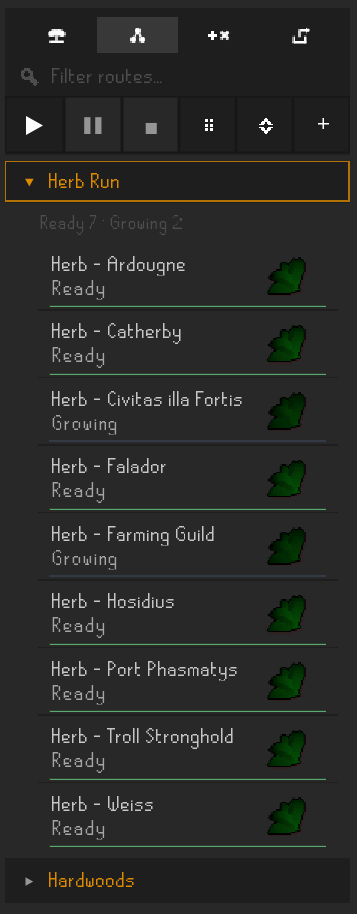
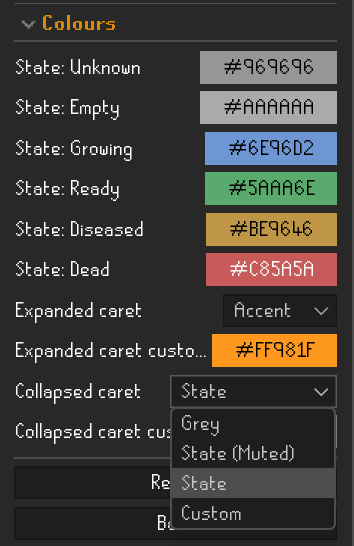

# Farm Utils

Farm Utils is a restrained RuneLite plugin for observing and organizing farming patch state in Old School RuneScape.

It focuses on visibility and interaction surface rather than optimization. It does not prescribe routes, enforce workflows, or claim authority over game mechanics. It provides structure and leaves decisions to the player.

> **Note:** Most organization features are intentionally **runtime-only** for now (routes, ordering, highlights, selection). Persistence will land once the feature set stabilizes and the dataset/code get an optimization pass.

---

## Patches Panel

The Patches panel presents your patch list as a manipulable surface:

- Observed / inferred patch state (e.g. *Empty*, *Growing*, *Ready*)
- Clear grouping by patch type and/or location
- Controls to hide individual patches (to keep the surface calm)

---

## Filtering

### Free text

Typing plain text filters across common fields (location, patch type, etc.).

### Fielded queries

Farm Utils also supports a compact, chainable filter syntax:

- `type:` / `t:` — patch type
- `loc:` / `l:` — location
- `state:` / `s:` — patch state

Values can be quoted when needed.

Examples:

- `falador`
- `t:herb l:"farming guild"`
- `s:ready t:tree`

---

## Selection & Reordering

The panel supports runtime-only multi-selection with standard semantics:

- Click for single select
- Ctrl to toggle
- Shift for range
- Ctrl+Shift for additive range

Right-click actions respect the current selection set.

Where structurally valid, patches and groups can be reordered (also runtime-only).

---

## Context Menu

Most per-patch actions live on the right-click menu:

- Manual state overrides (useful when observation is missing or lagging)
- Highlight slot assignment
- Add/remove patches to routes
- Hide patch (to reduce surface noise)

---

## Patch Highlights

Patch highlighting is **swatch-slot based**:

- Assign a patch to one of several highlight slots
- The slot appears as a small swatch on the row
- The same slot colour can be rendered as an in-world tile overlay

Current limitations:

- Highlights are runtime-only
- Patch *contents* highlighting (what’s planted) is not implemented yet
- Re-using highlights contextually (e.g. “highlight the current route”) is planned but not implemented yet

---

## Routes Panel

Routes are intended as **runtime-only grouping** / **lightweight planning**:

- Create, name, reorder, and delete routes
- Add/remove patches, reorder items within a route
- Keep commonly-used sets of patches together without turning the plugin into a route enforcer

---

## Configuration

Farm Utils exposes a handful of UI-focused configuration options, including:

- State colours
- Expanded/collapsed caret colour modes
- Text scale, header emphasis, and heading size
- Scrollbar visibility / style and “scroll anywhere”

---

## Core Features

- Patch tracking surface (with local observation + light inference)
- Smarter filter box (free text + fielded queries)
- Runtime-only multi-selection
- Drag reordering (where valid)
- Patch enable/disable (hide per row)
- Swatch-slot patch highlighting + in-world overlay
- Routes panel (runtime-only grouping / lightweight planning)
- UI polish: glyph-based toolbar, toolbar hiding, view/sort refinements

---

## Current Scope

Implemented:

- Patches panel + filtering
- Patch tile highlighting (swatch slots + overlay)
- Routes panel (create/edit/reorder)
- Basic UI customization (colours, text scale, scrollbar)

Not implemented (by design, for now):

- Persistence (routes / ordering / highlights)
- Patch contents highlighting
- Context-driven highlighting (e.g. route-aware overlays)
- “Special” patch support (e.g. Hespori, Tithe Farm, CoX)
- Cloud synchronization
- Social systems, reputation, or identity layers

Farm Utils is a local tool. Client-side state remains the source of truth.

---

## Coverage Notes

- Most **standard** farming patches are supported and safe to advertise.
- “Special” cases (Hespori/Tithe/CoX/etc.) are intentionally out of scope for the first release.
- Quest patches exist, but are still being verified and can be hidden via **Content → Hide quest patches**.
- Some locations may show **Unknown** until verified (notably a few edge locations like Prifddinas / Harmony Island herbs).
